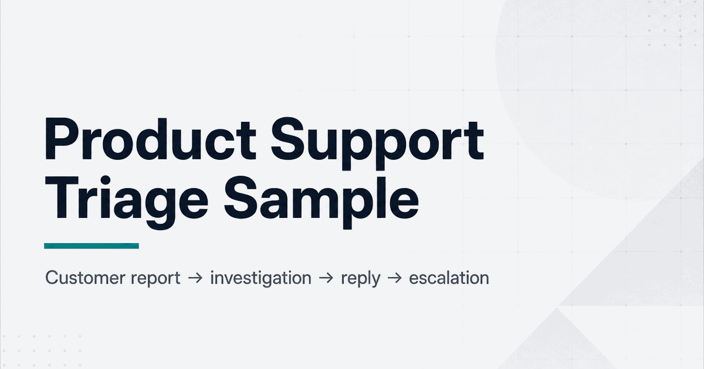

# Product Support Triage Sample



**Author:** Chien Escalera Duong  
**Type:** Public, synthetic support sample — safe for recruiters

This is a public, synthetic support sample showing how I would organize an integration issue from customer report to verified resolution (and, when needed, internal escalation). It is **not** from a real customer or employer.

---

## Recruiter quick path — 5 minutes

1. **[CASE-OUTCOME.md](./CASE-OUTCOME.md)** — the full story in one page
2. **[customer-reply.md](./customer-reply.md)** — customer communication
3. **[internal-escalation-note.md](./internal-escalation-note.md)** — engineering handoff
4. **[documentation-improvement-note.md](./documentation-improvement-note.md)** — prevention loop

Hiring managers who want depth: open [support-case-github-sync.md](./support-case-github-sync.md) after the quick path.

Role fit: [ROLE-MAPPING.md](./ROLE-MAPPING.md) · Visual flow: [docs/triage-flow-diagram.md](./docs/triage-flow-diagram.md)

---

## What this is

A fictional but realistic support case: a dev team connected GitHub to their project-management workspace, but pull request status is not updating on related work items. The repo contains the full triage workflow — customer replies, investigation notes, a completed outcome, escalation handoff, and a documentation improvement proposal.

Everything here is **synthetic sample work** designed to show my support craft without exposing private materials.

---

## Best-aligned roles

| Target role | Fit |
| --- | :---: |
| Product Support Specialist | Excellent |
| Technical Support Specialist | Excellent |
| Customer Operations Specialist | Strong |
| Onboarding Specialist | Strong |
| Junior Implementation Specialist | Strong |
| Customer Success Specialist | Moderate |
| Support Engineer | Moderate |

Full responsibility → proof map: [ROLE-MAPPING.md](./ROLE-MAPPING.md)

---

## Why it matters

Recruiters and hiring managers often ask: *Can this person triage technical user issues, communicate clearly, and feed useful signal back to the team?*

This artifact answers that with concrete examples — not claims about years of SaaS tenure.

---

## What it demonstrates

| Skill | Where to see it |
|-------|-----------------|
| Completed ownership loop | [CASE-OUTCOME.md](./CASE-OUTCOME.md) |
| Calm first response + clarifying questions | [customer-reply.md](./customer-reply.md) |
| Structured investigation and triage | [support-case-github-sync.md](./support-case-github-sync.md) |
| Engineering handoff quality | [internal-escalation-note.md](./internal-escalation-note.md) |
| Reducing repeat tickets through docs | [documentation-improvement-note.md](./documentation-improvement-note.md) |
| Log / webhook-style investigation depth | [evidence/](./evidence/) |

Core habits shown:

- Restate the user's problem before troubleshooting
- Gather minimum evidence before escalating
- Separate configuration issues from potential product bugs
- Use approved support access methods — never customer passwords
- Write for both the customer and the internal team
- Turn one ticket into a documentation improvement when patterns repeat

---

## Screenshots and visuals

| Asset | File |
| --- | --- |
| Social / LinkedIn preview (1200×630) | [docs/screenshots/social-preview.png](./docs/screenshots/social-preview.png) |
| Triage operating loop | [docs/screenshots/triage-flow.png](./docs/screenshots/triage-flow.png) |
| Annotated case excerpt | [docs/screenshots/annotated-case-excerpt.png](./docs/screenshots/annotated-case-excerpt.png) |

Mermaid source: [docs/triage-flow-diagram.md](./docs/triage-flow-diagram.md)

Set `docs/screenshots/social-preview.png` as the GitHub repository social preview (Settings → General → Social preview).

---

## How to run locally

Not applicable — this repo is markdown artifacts only. Clone and read:

```bash
git clone https://github.com/heyitschien/product-support-triage-sample.git
cd product-support-triage-sample
```

For deeper context, see [docs/recruiter-notes.md](./docs/recruiter-notes.md).

---

## Notes on privacy / scope

| In scope (public) | Out of scope (private or not claimed) |
|-------------------|---------------------------------------|
| Synthetic customer scenario | Real customer names, tickets, or employer data |
| Sample replies and internal notes | Production support tenure claims |
| Triage methodology and templates | Private Career OS or hunt strategy |
| Synthetic evidence packet | Real webhook / production logs |
| Documentation improvement ideas | Access to a real product's admin tools |

**Safe to share** with recruiters, pin on GitHub, or link from LinkedIn Featured.

---

## Related public work

- **Developer workflow walkthrough (YouTube):** [Supabase to Neon migration](https://www.youtube.com/watch?v=osexel8sixc) — plain-English technical explanation showing documentation and adoption thinking

---

## Contact

- **GitHub:** https://github.com/heyitschien
- **LinkedIn:** https://www.linkedin.com/in/chien-escalera-duong/
