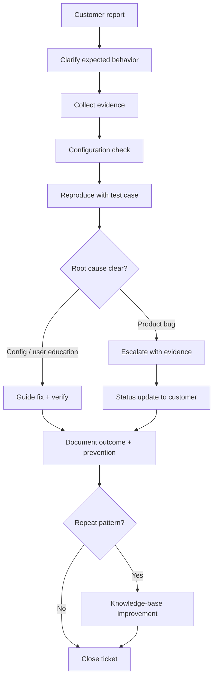

# Triage Flow Diagram

Synthetic support case flow for [SAMPLE-001](../support-case-github-sync.md) — GitHub integration sync issue.

## Operating loop



## Layer check order

```text
User expectation → workspace/team → integration settings → OAuth scope
→ org/repo permissions → reference format → sync/webhook → UI display
```

## Files at each stage

| Stage | Artifact |
| --- | --- |
| Customer report | [support-case-github-sync.md](../support-case-github-sync.md) — User report section |
| Clarify + status | [customer-reply.md](../customer-reply.md) |
| Evidence + config + reproduce | [support-case-github-sync.md](../support-case-github-sync.md) — Investigation + reproduction |
| Escalate | [internal-escalation-note.md](../internal-escalation-note.md) |
| Document prevention | [documentation-improvement-note.md](../documentation-improvement-note.md) |

See also: [IMPLEMENTATION-SPECIALIST-MAPPING.md](../IMPLEMENTATION-SPECIALIST-MAPPING.md)
